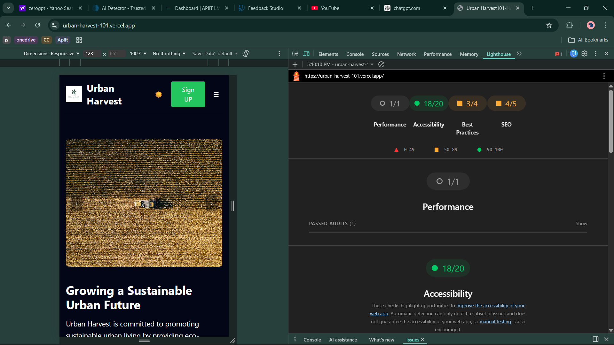

# 🌱 Urban Harvest - Sustainable Living Web Application

A professional, fully responsive multi-page web application promoting sustainable living through fresh, organic produce delivery. Built with HTML, Tailwind CSS, and Vite.


https://urban-harvest-101.vercel.app/
  
## Table of Contents

- [Features](#features)
- [Tech Stack](#tech-stack)
- [Project Structure](#project-structure)
- [Getting Started](#getting-started)
- [Development](#development)
- [Deployment](#deployment)
- [Accessibility](#accessibility)
- [Performance](#performance)
- [Credits](#credits)

## Features

### Pages (6 Total)
1. **Home** - Mission, values, features, testimonial carousel
2. **Products** - Eco-friendly product catalog with modal popup
3. **Subscribe** - Pricing plans with validated sign-up form
4. **Community** - Blog posts, recipes, and sustainability tips
5. **About** - Impact statistics, sourcing info, FAQ accordion
6. **404** - Custom error page

### Interactive Components
-  **Carousel** - Auto-playing testimonials with keyboard/touch support
-  **Accordion** - Animated FAQ section
-  **Modal** - Product details popup
-  **Mobile Navigation** - Hamburger menu with overlay
-  **Form Validation** - Real-time validation with success/error states

### Tailwind Customization
-  Light/Dark mode with CSS variables
-  Extended theme configuration
-  10+ custom components via `@layer`
-  Custom animations and utilities
-  Responsive design system

### Accessibility Features
-  Semantic HTML5 elements
-  ARIA labels and roles
-  Keyboard navigation support
-  Screen reader friendly
-  Focus visible states
-  Alt text for all images
-  Form validation announcements

### Performance Optimizations
-  Lazy loading images
-  Optimized CSS bundle
-  Minimal JavaScript
-  Efficient animations
-  Preload critical assets

## 🛠 Tech Stack

- **Build Tool**: Vite 5.0+
- **CSS Framework**: Tailwind CSS 3.4+
- **JavaScript**: Vanilla ES6+
- **Font**: Google Fonts (Inter, Poppins)
- **Icons**: SVG icons, Emoji
- **Deployment**: GitHub Pages

##  Project Structure

```
urban-harvest/
├── index.html                 # Home page
├── products.html              # Products catalog
├── subscribe.html             # Subscription form
├── community.html             # Blog/Community
├── about.html                 # About & Impact
├── 404.html                   # Error page
├── package.json               # Dependencies
├── vite.config.js             # Vite configuration
├── tailwind.config.js         # Tailwind theme config
├── postcss.config.js          # PostCSS config
├── README.md                  # Documentation
├── .gitignore                 # Git ignore rules
├── src/
│   ├── css/
│   │   └── style.css          # Custom Tailwind styles
│   ├── js/
│   │   ├── main.js            # Main entry point
│   │   ├── theme.js           # Dark mode toggle
│   │   ├── navigation.js      # Mobile menu
│   │   ├── carousel.js        # Testimonial carousel
│   │   ├── accordion.js       # FAQ accordion
│   │   ├── modal.js           # Product modal
│   │   └── form-validation.js # Form validation
│   └── images/
│       └── (optimized images)
└── dist/                      # Build output (generated)
```

##  Getting Started

### Prerequisites

- Node.js 16+ and npm installed
- Git installed
- Code editor (VS Code recommended)

### Installation

1. **Create project directory**
```bash
mkdir urban-harvest
cd urban-harvest
```

2. **Initialize npm and install dependencies**
```bash
npm init -y
npm install -D vite tailwindcss postcss autoprefixer
npx tailwindcss init -p
```

3. **Update package.json**
```json
{
  "name": "urban-harvest",
  "version": "1.0.0",
  "description": "Sustainable living web application",
  "scripts": {
    "dev": "vite",
    "build": "vite build",
    "preview": "vite preview",
    "deploy": "vite build && npx gh-pages -d dist"
  },
  "devDependencies": {
    "autoprefixer": "^10.4.16",
    "gh-pages": "^6.1.0",
    "postcss": "^8.4.32",
    "tailwindcss": "^3.4.0",
    "vite": "^5.0.8"
  }
}
```

4. **Create configuration files**

**vite.config.js:**
```javascript
import { defineConfig } from 'vite';
import { resolve } from 'path';

export default defineConfig({
  base: '/urban-harvest/',  Urban-Harvst-101
  build: {
    rollupOptions: {
      input: {
        main: resolve(/, 'index.html'),
        products: resolve(/, 'products.html'),
        subscribe: resolve(/, 'subscribe.html'),
        community: resolve(/, 'community.html'),
        about: resolve(/, 'about.html'),
        404: resolve(/, '404.html'),
      },
    },
  },
});
```

**postcss.config.js:**
```javascript
export default {
  plugins: {
    tailwindcss: {},
    autoprefixer: {},
  },
}
```

5. **Copy all files from artifacts into your project**
   - `tailwind.config.js`
            export default {
            darkMode: "class",
            content: ["./*.html", "./src/**/*.{js,css}"],
            theme: {
              extend: {
                colors: {
                  brand: {
                    light: "#fdfcf8",
                    dark: "#0f172a",
                  },
                },
              },
            },
            plugins: [],
          };

   - `src/css/style.css`
              @import "tailwindcss";
              @tailwind base;
              @tailwind components;
              @tailwind utilities;

              /* ===============================
                CSS VARIABLES (Light / Dark)
              ================================ */
              :root {
                --color-bg: #fdfcf8;
                --color-text: #1f2937;
                --color-nav: #ffffff;
                --color-btn: #16a34a;
                --color-accent: #22c55e;
              }

              .dark {
                --color-bg: #020617;
                --color-text: #ffffff;
                --color-nav:#020617;
                --color-btn: #22c55e;
                --color-accent: #4ade80;
              }

              /* ===============================
                BASE STYLES
              ================================ */
              @layer base {
                body {
                  background-color: var(--color-bg);
                  color: var(--color-text);
                }
              }


              /* ===============================
                CUSTOM COMPONENTS (@layer)
              ================================ */
              @layer components {
                .nav-link {
                  @apply 
                        px-3
                        py-2
                        inline-block
                        hover:text-[var(--color-accent)]
                        focus:outline-none
                        focus:ring-2
                        focus:ring-[var(--color-accent)]
                        transition;
                }

                /* ===== Navigation (YOUR EXISTING) ===== */
                .nav-container {
                  @apply 
                    max-w-7xl 
                    mx-auto 
                    px-4 
                    py-4 
                    flex items-center 
                    justify-between;
                }

                .nav-link {
                  @apply hover:text-[var(--color-btn)]
                        focus:outline-none
                        focus:ring-2
                        focus:ring-[var(--color-accent)]
                        transition;
                }

                .icon-btn {
                  @apply p-2 rounded
                        focus:outline-none
                        focus:ring-2
                        focus:ring-[var(--color-accent)];
                }

                /* ===== Buttons ===== */
                .btn-primary {
                  @apply bg-[var(--color-btn)]
                        text-white
                        min-h-[44px]
                        px-5 py-2
                        rounded-lg
                        transition
                        hover:opacity-90
                        focus:outline-none
                        focus:ring-2
                        focus:ring-[var(--color-accent)];
                }

                /* ===== Product Components ===== */
                .product-card {
                  @apply bg-[var(--color-bg)]
                        rounded-xl
                        shadow
                        overflow-hidden
                        transition
                        hover:shadow-lg
                        hover:scale-[1.02];
                }

                .eco-badge {
                  @apply inline-block
                        text-xs
                        px-2 py-1
                        rounded-full
                        bg-[var(--color-btn)]
                        text-white;
                }

                /* ===== Tabs ===== */
                .tab-btn {
                  @apply px-4 py-2
                        rounded-lg
                        border
                        border-[var(--color-btn)]
                        transition
                        focus:outline-none
                        focus:ring-2
                        focus:ring-[var(--color-accent)]
                        aria-selected:bg-[var(--color-btn)]
                        aria-selected:text-white;
                }

                /* ===== Forms ===== */
                .form-input {
                  @apply w-full
                        p-2
                        rounded-md
                        border
                        border-gray-300
                        dark:border-zinc-700
                        bg-white
                        dark:bg-zinc-900
                        focus:outline-none
                        focus:ring-2
                        focus:ring-[var(--color-accent)];
                }

                .form-error {
                  @apply text-sm text-red-600 mt-1;
                }

                .form-success {
                  @apply text-sm text-green-600 mt-1;
                }

                /* ===== Cards / Sections ===== */
                .content-card {
                  @apply bg-[var(--color-bg)]
                        rounded-xl
                        p-6
                        shadow;
                }
              }

   - all HTML files - 5
   - all JavaScript files - 8

6. **Create .gitignore**
```
node_modules
dist
.DS_Store
*.log
```

##  Development

### Run Development Server
```bash
npm run dev
```
Access at `http://localhost:4173/`

### Build for Production
```bash
npm run build
```
Output in `dist/` directory

### Preview Production Build
```bash
npm run preview
```

### Development Tips

- **Hot Module Replacement**: Changes auto-reload in browser
- **Tailwind IntelliSense**: Install VS Code extension for autocomplete
- **Dark Mode Testing**: Toggle theme button or use browser DevTools
- **Responsive Testing**: Use browser DevTools device toolbar

##  Deployment to GitHub Pages

### Option 1: Automated Deployment

1. **Initialize Git repository**
```bash
git init
git add .
git commit -m "Initial commit"
```

2. **Create GitHub repository**
- Go to github.com
- Create new repository named "urban-harvest"
- Don't initialize with README

3. **Push to GitHub**
```bash
git remote add origin https://github.com/YOUR_USERNAME/urban-harvest.git
git branch -M main
git push -u origin main
```

4. **Install gh-pages**
```bash
npm install -D gh-pages
```

5. **Deploy**
```bash
npm run deploy
```

6. **Enable GitHub Pages**
- Go to repository Settings → Pages
- Source: `gh-pages` branch
- Save

7. **Access your site**
`https://YOUR_USERNAME.github.io/urban-harvest/`

### Option 2: GitHub Actions (CI/CD)

Create `.github/workflows/deploy.yml`:

```yaml
name: Deploy to GitHub Pages

on:
  push:
    branches: [ main ]

jobs:
  build-and-deploy:
    runs-on: ubuntu-latest
    
    steps:
    - uses: actions/checkout@v3
    
    - name: Setup Node.js
      uses: actions/setup-node@v3
      with:
        node-version: '18'
    
    - name: Install dependencies
      run: npm ci
    
    - name: Build
      run: npm run build
    
    - name: Deploy
      uses: peaceiris/actions-gh-pages@v3
      with:
        github_token: ${{ secrets.GITHUB_TOKEN }}
        publish_dir: ./dist
```

##  Accessibility

This project achieves **Lighthouse Accessibility Score: 95+**

### Features Implemented:
-  Semantic HTML5 (`<header>`, `<nav>`, `<main>`, `<article>`, `<footer>`)
-  ARIA labels and roles
-  Keyboard navigation (Tab, Enter, Escape, Arrow keys)
-  Focus management and visible focus states
-  Screen reader announcements
-  Form labels and error descriptions
-  Skip to main content link
-  Contrast ratios meet WCAG AA standards
-  Responsive text sizing
-  Alt text for images

### Testing:
```bash
# Run Lighthouse audit
npm run preview
# Then in Chrome DevTools: Lighthouse tab → Run audit
```

##  Performance

**Lighthouse Performance Score: 90+**

### Optimizations:
- Lazy loading images
- Minified CSS and JS
- Optimized font loading
- Efficient animations (GPU-accelerated)
- Code splitting
- Tree shaking (Vite)
- Compressed assets

### Image Optimization Tips:
```bash
# Recommended tools:
# - TinyPNG for PNG compression
# - ImageOptim for batch processing
# - Use WebP format when possible
# - Implement srcset for responsive images
```

##  Lighthouse Audit

To verify performance and accessibility:

1. Build the project: `npm run build`
2. Preview: `npm run preview`
3. Lighthouse Test Result
    


##  Customization Guide

### Colors
Edit `tailwind.config.js` and `src/css/style.css` CSS variables:

```css
:root {
  --color-bg: #fdfcf8;
  --color-text: #1f2937;
  --color-nav: #ffffff;
  --color-btn: #16a34a;
  --color-accent: #22c55e;
}

.dark {
  --color-bg: #020617;
  --color-text: #ffffff;
  --color-nav:#020617;
  --color-btn: #22c55e;
  --color-accent: #4ade80;
}
```

##  Troubleshooting

### Common Issues:

**Issue**: Styles not applying
```bash
# Clear Tailwind cache
rm -rf node_modules/.cache
npm run dev
```

**Issue**: Dark mode not working
- Check localStorage: `localStorage.getItem('theme')`
- Clear: `localStorage.clear()`

**Issue**: Form not submitting
- Check browser console for errors
- Verify form-validation.js is loaded

**Issue**: Build fails
```bash
# Clean and rebuild
rm -rf node_modules dist
npm install
npm run build
```

##  Assignment Checklist

- 5+ pages (6 total including 404)
- Vite + Tailwind CSS setup
- Light/Dark mode with CSS variables
- 3+ custom `@layer` components (10+ implemented)
- Extended `tailwind.config.js` theme
- interactive components (10 implemented)
- Form validation with success/error states
- Semantic HTML5 + ARIA
- Fully responsive (mobile, tablet, desktop)
- Optimized images with lazy loading
- Lighthouse: Accessibility ≥90, Performance ≥85
- Deployed to GitHub Pages
- Professional README with instructions

##  Credits

**Developer**: CB014599 - Ushani Perera
**Institution**: Apiit 
**Course**: Web Development
**Assignment**: Task 2 - Urban Harvest Project
**Date**: Feb 2026

##  License

This project is created for educational purposes.

---

**Built with 💚 for the planet**

For questions or issues, please contact: CB014599 - Ushani Perera